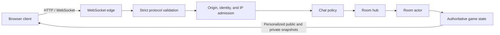

# midnight-council

Midnight Council is a browser-based, real-time social deduction game prototype inspired by classic night-and-day party games.

The Go server and its embedded web client already support a repeatable playable loop: nickname-based player or spectator join, room readiness and administration, owner start, random hidden-role assignment, real-time chat, night actions, day discussion, voting, execution, timed last words, win detection, settlement, return to waiting, rematches, and reconnect-token based disconnect/reconnect.



## Quick Start

Run the complete game with Docker Compose:

```bash
docker compose up --build
```

Then open `http://localhost:8080` and use an incognito window or another browser profile to join the same room as a second player.

For native development, install Go `1.26.4` or newer and run:

```bash
make test
make run
```

The browser client is embedded in the Go binary; there is no frontend build step. See [`docs/deployment.md`](docs/deployment.md) for configuration, reverse-proxy guidance, and the included WebSocket load-test harness. A reproducible local `100 rooms × 10 players` baseline is available in [`docs/benchmarks.md`](docs/benchmarks.md).

## Current Scope

- Go HTTP/WebSocket game server
- Embedded responsive web client with no frontend build step
- Room actor per room
- Server-authoritative game state
- Public room snapshots plus per-player private state
- Six prototype roles:
  - `VILLAGER`
  - `KILLER`
  - `DETECTIVE`
  - `DOCTOR`
  - `ESCORT`
  - `SHOOTER`
- Day/night state machine
- Server-authoritative phase deadlines and automatic progression
- Night actions and pass events
- Day voting and execution
- Timed last words with speaker-only chat after vote execution
- Shooter one-shot day action
- Win detection and game result reveal
- Reconnect token for existing player seats
- Automatic browser reconnect with capped exponential backoff
- One active WebSocket per seat, with newer valid connections replacing older ones
- Sequenced client events, server acknowledgements, and reconnect-safe deduplication
- Public disconnected and AFK participant indicators
- Player and spectator participation modes
- Owner transfer, kick, room lock, and configurable player cap
- Return-to-waiting reset and same-room rematches
- Room-owned phase timing, minimum players, role pool, and death-reveal settings
- Server-authoritative standard, quick, beginner, advanced, and minimal rule presets
- Server validation for duration bounds, player-cap compatibility, and legal role balance
- Room idle timeout and hub cleanup
- Public event log for game flow
- Strict WebSocket client event schema validation
- Per-connection token-bucket limits for chat and game events
- Pluggable allow, reject, or replace chat moderation policy with a default allow implementation
- Unit-tested room state rules
- WebSocket integration tests for a full multiplayer game flow
- Browser session recovery through local reconnect-token storage
- Server-synchronized phase countdown on desktop and mobile

Not included yet: persistent accounts, JWT auth, PostgreSQL, Redis, built-in moderation rules, report and ban workflows, distributed rate limiting, or horizontal scaling.

See [`docs/architecture.md`](docs/architecture.md), [`docs/web-client.md`](docs/web-client.md), [`docs/websocket-protocol.md`](docs/websocket-protocol.md), and [`docs/roadmap.md`](docs/roadmap.md) for design details and upcoming work.

## Development and Verification

The Make targets use the `go` executable on your `PATH`; no project-specific conda path is required.

```bash
make fmt
make fmt-check
make vet
make test
make test-race
make js-check
```

`make test-race` needs a Go toolchain with its normal C toolchain support. The GitHub Actions workflow runs formatting, vet, unit/integration tests, race detection, JavaScript syntax validation, and the browser E2E suite on every push to `main` and every pull request.

Install the test-only browser dependency to run the same E2E suite locally:

```bash
npm ci
npx playwright install chromium
npm run test:e2e
```

The Playwright scenario uses four independent browser contexts to cover joining, private role projection, a night action, reconnect-token recovery, voting, game settlement, and a same-room rematch.

The server listens on `:8080` by default. `ADDR` takes precedence; when it is unset, the server uses the PaaS-provided `PORT` value:

```bash
ADDR=:8081 make run
```

For a container PaaS, leave `ADDR` unset so an injected `PORT` such as `10000` is honored. See [`docs/deployment.md`](docs/deployment.md) for trusted proxy configuration and a public container PaaS deployment runbook.

Rooms with no active WebSocket subscribers are removed after `30m` by default. Override with `ROOM_IDLE_TIMEOUT`:

```bash
ROOM_IDLE_TIMEOUT=5m make run
```

Active game phases have server-authoritative deadlines. These process values seed each room's `STANDARD` preset; the room owner may choose another preset or custom settings before a game:

| Environment variable | Default | Phase |
| --- | ---: | --- |
| `NIGHT_DURATION` | `1m30s` | Night actions |
| `DAY_DISCUSSION_DURATION` | `5m` | Public discussion |
| `DAY_VOTING_DURATION` | `1m` | Voting |
| `LAST_WORDS_DURATION` | `30s` | Executed player's last words |

All phase durations must be positive Go duration strings. For a fast local timing check:

```bash
NIGHT_DURATION=10s DAY_DISCUSSION_DURATION=15s DAY_VOTING_DURATION=10s LAST_WORDS_DURATION=8s make run
```

Every WebSocket connection has separate token buckets for chat and game events. Valid events that exceed a bucket are rejected before they reach the room actor. Defaults and overrides are:

| Environment variable | Default | Meaning |
| --- | ---: | --- |
| `WS_CHAT_EVENTS_PER_SECOND` | `1` | Sustained chat refill rate |
| `WS_CHAT_BURST` | `5` | Maximum immediate chat burst |
| `WS_GAME_EVENTS_PER_SECOND` | `5` | Sustained non-chat event refill rate |
| `WS_GAME_BURST` | `10` | Maximum immediate non-chat burst |

Rates may be fractional, and every rate and burst must be positive. Buckets start full and belong to one socket only; reconnecting creates fresh buckets. For stricter local testing:

```bash
WS_CHAT_EVENTS_PER_SECOND=0.5 WS_CHAT_BURST=2 WS_GAME_EVENTS_PER_SECOND=2 WS_GAME_BURST=4 make run
```

Before public deployment, configure the exact browser origins and admission limits described in [`docs/deployment.md`](docs/deployment.md). The server defaults to same-host WebSocket origins, validates room and participant identifiers server-side, limits new connections and room creation per direct IP, caps room actors globally, and caps spectators per room.

Validated, rate-limited chat is then passed to a `moderation.ChatPolicy` before room dispatch. The policy can allow the original message, reject it with an optional public reason, or replace it. The server defaults to `moderation.AllowAllChat`; deployments can inject another implementation through `ws.WithChatPolicy`. Policy failures and invalid replacements fail closed and never broadcast the original message.

Open the game client after starting the server:

```text
http://localhost:8080
```

Use separate browser profiles or private windows when testing multiple players on one computer. Tabs in the same browser profile intentionally share the saved seat for a room.

## Browser Client

The root route serves a responsive Traditional Chinese game interface embedded in the Go binary. There is no Node.js install or asset build required to run it.

The client supports:

- room creation and invitation links
- player or spectator join
- player readiness, owner administration, and same-room rematches
- public game-setting summary and owner-only preset/custom editor
- private role and investigation displays
- role-aware night actions and passing
- public discussion, voting, abstaining, and shooter actions
- timed last-words view with speaker-only chat controls
- public game log and final role reveal
- reconnect-token recovery after refresh
- automatic recovery after temporary live-connection loss
- pending-event replay with server sequence acknowledgements
- visible disconnected and two-minute AFK status
- countdown synchronized to server time
- desktop and mobile layouts

The browser stores a generated `player_id`, display name, reconnect token, next client sequence, and unacknowledged events per room in local storage. A temporary disconnect triggers automatic reconnect and ordered replay; an already-applied sequence is acknowledged as a duplicate without running the action twice. The reconnect token is never displayed or included in public room state. Chat is live-only beyond any unacknowledged send and is not retained as history; authoritative game events remain available in the room log.

See [`docs/web-client.md`](docs/web-client.md) for client behavior, storage, and current limitations.

## WebSocket API

Rooms are created implicitly when the first player connects to a room URL.

Client event format is enforced by Go structs plus `go-playground/validator`.
The mirrored JSON Schema lives at:

```text
docs/websocket-client-event.schema.json
```

Connect:

```text
ws://localhost:8080/ws/rooms/{room_id}?player_id={player_id}&name={display_name}
```

Join as a spectator:

```text
ws://localhost:8080/ws/rooms/{room_id}?player_id={player_id}&name={display_name}&spectator=true
```

Reconnect to an existing player seat:

```text
ws://localhost:8080/ws/rooms/{room_id}?player_id={player_id}&name={display_name}&reconnect_token={private_token}
```

The server broadcasts envelopes:

```json
{
  "type": "state",
  "state": {
    "room_id": "demo",
    "owner_id": "p1",
    "phase": "NIGHT",
    "phase_started_at": "2026-07-14T09:00:00Z",
    "phase_deadline": "2026-07-14T09:01:30Z",
    "server_time": "2026-07-14T09:00:10Z",
    "round": 1,
    "players": [],
    "spectators": [],
    "locked": false,
    "max_players": 12,
    "game_settings": {
      "preset": "STANDARD",
      "night_duration": "1m30s",
      "day_discussion_duration": "5m0s",
      "day_voting_duration": "1m0s",
      "last_words_duration": "30s",
      "minimum_players": 2,
      "reveal_roles_on_death": false,
      "roles": {
        "killers": 1,
        "detectives": 1,
        "doctors": 1,
        "escorts": 0,
        "shooters": 1
      }
    }
  },
  "private": {
    "player_id": "p1",
    "reconnect_token": "private-token",
    "role": "DETECTIVE",
    "alive": true,
    "action_required": true,
    "available": ["night_action", "night_pass"]
  }
}
```

`state` is safe to broadcast to everyone. `private` is generated per subscriber and contains only that player's own hidden information, including the reconnect token needed to reclaim the same seat.

### Client Events

The browser adds a positive safe-integer `sequence` to every event. It is optional for backward-compatible clients, but sequenced events receive an `ack` and can be replayed safely after reconnect:

```json
{"type":"ready","sequence":1,"ready":true}
```

Ready:

```json
{"type":"ready","ready":true}
```

Chat:

```json
{"type":"chat","message":"hello"}
```

Owner starts the game:

```json
{"type":"start_game"}
```

Night action:

```json
{"type":"night_action","target_id":"p2"}
```

Night pass:

```json
{"type":"night_pass"}
```

Owner starts voting after day discussion:

```json
{"type":"start_vote"}
```

Vote or abstain:

```json
{"type":"vote","target_id":"p2"}
```

```json
{"type":"vote"}
```

Shooter day action:

```json
{"type":"shoot","target_id":"p2"}
```

Owner room administration:

```json
{"type":"transfer_owner","target_id":"p2"}
```

```json
{"type":"kick_participant","target_id":"p2"}
```

```json
{"type":"set_room_locked","locked":true}
```

```json
{"type":"set_player_limit","max_players":8}
```

Return an active or finished room to `WAITING` for a rematch:

```json
{"type":"return_to_waiting"}
```

Apply a server-defined game preset:

```json
{"type":"set_game_preset","preset":"QUICK"}
```

Set complete custom game settings:

```json
{
  "type": "set_game_settings",
  "night_duration": "45s",
  "day_discussion_duration": "2m",
  "day_voting_duration": "45s",
  "last_words_duration": "20s",
  "minimum_players": 4,
  "reveal_roles_on_death": true,
  "killers": 1,
  "detectives": 1,
  "doctors": 1,
  "escorts": 0,
  "shooters": 0
}
```

## Game Flow

1. Players and optional spectators connect to the same room URL.
2. Non-owner players send `ready`.
3. The owner selects a preset or custom rules, then sends `start_game` after the configured minimum player count and readiness requirements are met.
4. The server shuffles roles and enters `NIGHT`.
5. Alive `KILLER`, `DETECTIVE`, `DOCTOR`, and enabled `ESCORT` players submit `night_action` or `night_pass`; missing actions become passes when the night deadline expires.
6. The server resolves role actions in rule-defined order: escort blocks, doctor protection, killer attacks, then detective results.
7. If no side has won, the room enters `DAY_DISCUSSION`.
8. The owner sends `start_vote`, or the discussion deadline starts voting automatically.
9. Alive players vote. The server resolves execution when everyone has voted; missing votes become abstentions at the voting deadline.
10. When voting executes a player, the room enters timed `LAST_WORDS`; only that player may use public chat.
11. At the last-words deadline, the server either finishes the game or starts the next night. A tied or empty vote skips last words.
11. The owner can return the room to `WAITING`; connected seats remain, game-only state is cleared, and players ready for the next match.

Win rules:

- Villagers win when all killers are dead.
- Killers win when living killers are greater than or equal to living non-killers.
